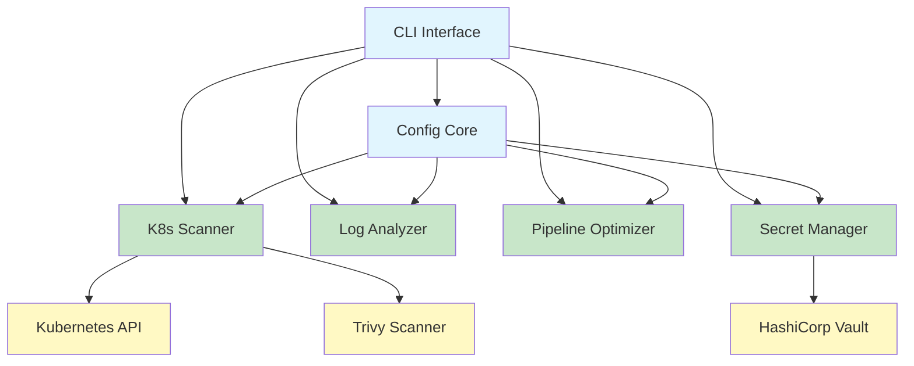

🧊 OpenKrait  
Wake up to the smell of coffee, not to PagerDuty.

LICENSE MIT

<details open>
<summary>📑 Table of Contents</summary>

1. [What & Why](#what--why)  
2. [How it works](#how-it-works)  
3. [Quick start](#quick-start)  
4. [Usage examples](#usage-examples)  
5. [Customising rules](#customising-rules)  
6. [Tech specs](#tech-specs)  
7. [Roadmap](#roadmap)  
8. [Contributing](#contributing)

</details>

<a name="what--why"></a>
## 🎯 What & Why

OpenKrait is a modular morning-diagnosis CLI for Kubernetes, CI pipelines and logs.  
It scans manifests, analyses logs and checks pipelines while you sleep, so you can wake up to actionable hints instead of red dashboards.

| Pain we solve                | How OpenKrait helps                                                                 |
| ---------------------------- | ----------------------------------------------------------------------------------- |
| «Where do I even start?»     | One command shows the **top 3 issues** ordered by blast radius                      |
| «Another CVE scanner?»       | We **merge** vulns, mis-configs & pipeline anti-patterns into **one report**        |
| «Too much noise»             | Opinionated **severity filter** + **size limits** (≤10 MB logs, ≤10 secrets)        |
| «YAML fatigue»               | Add new rules **without touching code** – just drop them into `config.yaml`         |

<a name="how-it-works"></a>
## 🧠 How it works




| Component              | Super-powers                                                                             |
| ---------------------- | ---------------------------------------------------------------------------------------- |
| **Config Core**        | Hierarchical YAML, dot-notation, hot-reload, fail-safe defaults                          |
| **K8s Scanner**        | Auto-detects in-cluster / local kubeconfig, respects API rate-limits, couples with Trivy |
| **Log Analyzer**       | Sanitises paths, refuses files >10 MB, surfaces **error counts** without leaking data    |
| **Secret Manager**     | HTTPS-only, SSL-verify on, accepts **stdin** for automation, honours Vault quotas        |
| **Pipeline Optimizer** | Auto-detects Jenkins / GitLab / GitHub, suggests caching & parallelisation tweaks        |

<a name="quick-start"> </a>
🚀 Quick start
  
| pip                     | Docker                                                                 |
| ----------------------- | ---------------------------------------------------------------------- |
| `pip install openkrait` | `docker run --rm -v $PWD:/data your-username/openkrait:1.0.0 scan-k8s` |

After install:

openkrait --help

<a name="usage-examples"> </a>
💡 Usage examples
  
| Goal               | Command                                              | What you get                                                 |
| ------------------ | ---------------------------------------------------- | ------------------------------------------------------------ |
| **Cluster health** | `openkrait scan-k8s`                                 | List of vulnerable images + ConfigMaps with suspicious keys  |
| **Log forensics**  | `openkrait analyze-logs --log-path /var/log/app.log` | ERROR/WARN count, top offending modules, **no raw lines**    |
| **Secret hygiene** | `echo "my-secret" \| openkrait store-secret-stdin`   | Stores in Vault, checks quota, enforces HTTPS                |
| **Faster CI**      | `openkrait optimize-pipeline --pipeline Jenkinsfile` | Platform-specific hints: `stash`, `cache`, `parallel` blocks |

<a name="customising-rules"> </a>
⚙️ Customising rules
Drop a `config.yaml` next to the binary – no restart required.

```yaml
vulnerability:
  images:
    - pattern: "^my-old-image:.*"
      recommendation: "Bump to my-new-image:1.27"
      severity: low

limits:
  max_secrets: 10
  max_log_size_mb: 10
```

| Key                              | Type            | Description                    |
| -------------------------------- | --------------- | ------------------------------ |
| `vulnerability.images[].pattern` | regex           | Image name to match            |
| `*.recommendation`               | string          | Human-fix hint shown in report |
| `*.severity`                     | low｜medium｜high | Opinionated ordering         |


<a name="tech-specs"> </a>
📊 Tech specs
  
| Metric            | Value                                                        |
| ----------------- | ------------------------------------------------------------ |
| **Test coverage** | 75 %                                                         |
| **Python**        | 3.8+                                                         |
| **Core deps**     | `click`, `kubernetes`, `pyyaml`, `hvac`                      |
| **Docker image**  | < 100 MB (distroless)                                        |
| **License**       | MIT                                                          |
| **Repo**          | [github.com/Rafned/openkrait](https://github.com/you/openkrait) |

  
<a name="contributing"> </a>
🤝 Contributing  
PRs are welcome!  
Please run `make test lint` before push – CI will do the rest.

<div align="center">

Star ⭐ if OpenKrait saved your morning coffee!

</div>
